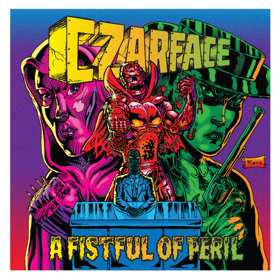

*You had one job, spit extraordinary lines  
instead you came with Extraordinary Rhymes…*  
  
— Esoteric  

# ExtraordinaryRhymes
A simple web app for writing song lyrics.
## Table of Contents
### 2.0 Preliminary Project Proposal
### 3.0 Project Proposal
### 5.0 Software Requirements Specification

## 2.0 Preliminary Project Proposal

The title of this project is: *Extraordinary Rhymes*. It is web app designed for functionality on desktop computers, tablets, and mobile devices. The app is a web page that allows the user to input lyrics via a text field and helps the user to write song lyrics. The app is targeted toward writing rhymes for rap songs (hip-hop). To this end, the app helps in about five different ways: 1) highlighting rhymes found within the lyrics and *suggesting* rhymes if the user is following a rhyme scheme, 2) allowing the user to label sections of the text as belong to different parts of the song (i.e. the chorus, the verse(s), the intro), perhaps using color highlighting, 3) counting bars or syllables within individual bars, 4) perhaps a dictionary or thesaurus function, and 5) helping the user to fit the song into popular existing song structures (AABA) or rhyme schemes as well as educating the user on different rhyme schemes. In all likelihood, the app will not include all five features, but perhaps only a smattering of them.

## 3.0 Project Proposal

For a brief overview of the project, see the above section. The app will be a web app, there will therefore be no downloadable form of the app, neither on a desktop OS, a tablet, or a phone. The app will be built primarily using client-side web technologies, such as jQuery, JavaScript, HTML, CSS, and so on and so forth. Calls to various API services will be made using Ajax requests. The app can be hosted on any web server desired, whether it be a Python, Apache, or Node.js web server, the choice is trivial. Most of the business logic for the app will reside within the JavaScript files created for the app.

When the user is finished typing their lyrics we will allow one of two export forms: 1) a desktop user will receive and exported HTML file formatted to retain the highlighting and annotating of his lyrics, or 2) a mobile user will receive an e-mail to a link containing their exported lyrics.

A possible idea for exporting includes sending pictures of the highlighted lyrics. This will remove the possibility of the user copying and pasting his lyrics, but it provides all of the information in a neat snapshot. Development of the app will be targeted toward desktop users primarily, so we will not be sorry if we fail to implement a static linking service or a picture e-mailing service for mobile users.

## 5.0 Software Requirements Specification

### 5.1 Introduction

Extraordinary Rhymes is a simple client-side web app that marks up song lyrics entered by the user. The app is intended to help the user find rhymes within their lyrics, and will give the option of helping the user structure their song in blocks. The app will also include features such as rhyme-scheme enforcement and suggestion of lyrics.

The remainder of this document is structured as follows: section 5.2 contains functional requirements, section 5.3 will describe performance requirements for the app, and section 5.4 will contain environment requirements.

### 5.2 Functional Requirements

#### 5.2.1 index.html (the landing page)
##### 5.2.1.1 The landing page shall provide a set of a replicatable blocks that the user can drag and drop to structure a song. At the very least these blocks shall contain: an Intro block, a Verse block, an Outro block, a Chorus block, and a Bridge block. These blocks shall be text fields constrained to only accept what is applicable to each of the block’s nuances.
##### 5.2.1.2 The landing page shall display a marked up, un-editable, text field featuring the user’s lyrics, annotated, with rhymes indicated. Additional information about the lyrics shall be displayed adjacent to the body of lyrics itself. Rhymes will be indicated by colored highlighting of texts, blocks of lyrics will be annotated by a small note above each block (for example: “Verse 1”, or “Chorus”). The marked up text field will be displayed adjacent to the block sandbox.
##### 5.2.1.3 The landing page shall provide two options for exporting the song lyrics:
1. As an image file sent to one’s e-mail.
2. As a marked up HTML file.

#### 5.2.2 *.js
##### 5.2.1.1 The app shall provide the following features:
1.	Users can enforce rhyme schemes on phrases.
  1.	Rhyme schemes can follow any format:
    1.	AABB
    2.	ABAB
  2.	Internal rhyme and end rhyme are supported.
  3.	Multisyllabic rhymes (feminine rhymes) are supported.
2.	Users can query the app for rhyme suggestions.
  1.	Suggestions can follow certain dimensions:
    1.	Do you want a noun?
    2.	A verb?
3.	Users can apply pre-templated song structures.
  1.	32-bar form.
  2.	Verse-chorus form.
4.	Users can force highlight rhyme recognition.
  1.	The app will consider two words to rhyme in order to fit a schema, even if the app (or API) fails to detect this rhyme.
5.	The app shall annotate Bar lines.
6.	The app shall count syllables (for each Bar).

### 5.3 Performance Requirements

1.	This app shall be hosted on a web server with a domain name indicating its address.
2.	The app, if queried by a mobile device, such as a phone or tablet, shall display a responsive and mobile-friendly web page that will allow the user to perform all functions satisfactorily.
3.	The app, if queried by a desktop PC, shall function satisfactorily.

### 5.4 Environment Requirements

Development of this app shall require a syntax-highlighting IDE, a working Git installation, and a modern web browser. Execution of this app shall require a modern web browser with an up-to-date JavaScript engine. Deployment of this app shall require a dedicated or virtual private server with an installation of nginx, Apache, or some equivalent web server. Deployment of this app shall require a domain exclusive to the app, such as *extraordinaryrhymes.com*. 
